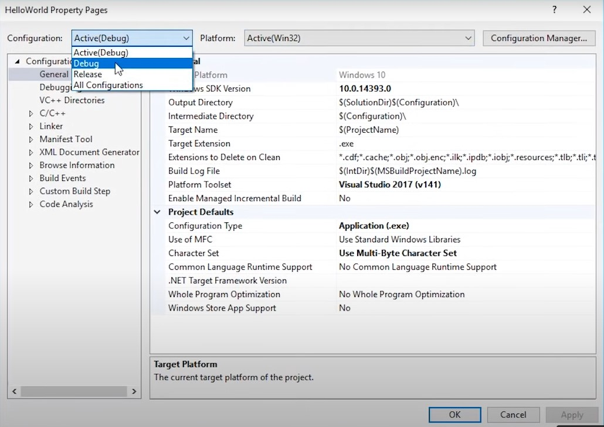

# 1.  

```c++
#include <iostream>
int main()
{
    std::cout << "Hello, World!" << std::endl;
    std::cin.get();
}
```
- `std::cout` - its bascially print out the what is written after the angular brackets.
- `std::endl` - it bascially tells our console to advance to the next line.
- `std::cin.get()` - in this case it will wait until we press ENTER before advanicing to next line of code which is nothig.

AFter that we advance to next line which means nohting, which returns zero meainng our porgram executed successfully.

`#include <iostream>` - it's called a pre-processor statement, it gets evaluated before we compile the file. In this case it will copy all the content of the isostream file into this file. It copies and paste inot this file. We inclue <iostream> to use `std::cout` and `std::cin.get()` functions
- once the preprocessor statement gets evaluated, our file gets compiled
- This is stage where our compiler transforms all of this C++ code into actual machine code.

Configuration - is simply a set of rules which applies to the building of a project.

Solution platform - is what platform we are trageting with our current compilation.

Example x86 is targeting windows 32-bit which means that we will generate a 32-bot application for windows. win32 is same as x86



- Make sure that your configuration and your platform is set to the one which you actually want to modify. For some reason sometimes it might set to release however you are clearly building debug. Which means that none of these changes will apply to your current configurations.

The important thing to note here is that configuration type is set `Application(.exe)`


- Compiler setting are found in C/C++


- if I change my configuration from debug to release than optimiztion is set to the Maximize speed whereas is debug it is set to the Disabled.

* Thats a great example why debug mode is slower than release mode because optimiztion is turned off but offcourse turning off optimiztion will help us debug our code.

- Each CPP file in our project gets compiled, Header file do not get compiled at all, just CPP files, header files are included via a preprocessor statement called `#include` into a CPP file.

- We've got a bunch of CPP files that we've compiled and they actually get compiled individually.

- Every CPP file in our project gets compiled into a something called object file. Once we've all of those obj files which are the result of compiling our CPP files. We need some way to stich them together into one exe file that's where the Linker comes in.
- Linker takes all of the obj files and glue them together into one exe file.
 
main.cpp
 ```c++
 #include <iostream>

int main()
{
    log("Hello World!")
    std::cin.get()
}

In viusal studio you can compile individual file by just pressing ctrl+F7
```
log.cpp
```c++
#include <iostream>
void Log(const char* message)
{
    std::cout << message << std::endl;
}
```
If I want to call log in the main.cpp, I can't because log is not found.

- we have defined one function seperately and we are compiling each file seperately so this main.cpp file has no idea that there's function called log anywhere and since it doesn't recognize what log is. It gives us the compile error. We can fix this by providing something called declaration a declartaion is exactly what is sounds like, we are declaring that something called log exists, now this is almost like a promise and the compiler will just belive us. Compiler doesn't care about resolving where that log function actually is defined.

- we have two different words here definations and declarations. Declarations are just statement which say, this function exists and defintion is something that says this is what this functions is, this is the body of this function.

- Declaration looks very similar to an actual defination However, what is doesn't have is the actual body

- Now let's define the declaration in the main.cpp file.

main.cpp
 ```c++
 #include <iostream>
 void Log(constant char * message);

int main()
{
    log("Hello World!")
    std::cin.get()
}
```

So when we build this code it just compile the main.cpp without showing an error. But how does the compiler know that the log file exists if we are just compiling this one file. The answer is it doesn't. So how does it actually run the right code. Thats where the Linker comes in.

- When we build our entire project not just this one file, once our file have been compiled the linker will actually find the defination of that log funtion and wire it up to the log function that we call here in the main.cpp, If it can't find that defination that when we get `linker error`.

# 2. Compiler

The compiler job at the end of the day is to convert all of our code into constant data or inststructions. Once th compiler has created this abstract syntax tree, it can begin actually generating code, now this code is going to be the actual machine code that our CPU will execute.

- what the compiler does is generated object files for each of our C++ files for each of our translation units. Now every CPP files that our project contians, every CPP files will result in an object file. These CPP files are things called translation units. C++ doesn't care about files, files are not that something whihc exist in C++. A file is just a way to feed the compiler with source code. You're resposible for telling the compiler what kind of file type this is and how the compiler should treat that. If you create the file with the extension CPP, the compiler will treat that as a C++ file. And compiler will treat the .h file like a heeader file.

-  So, every C++ file that we feed into the compiler and we tell it this is as a translation unit and a translation unit will result in an object file

- First stage of compilation pre-processing during the pre-processing stage, the compiler will bascially just go through all of our pre-processing statements and evaluate them. The ones that we commonly use are include, define, if and ifdef.

- One of the most common pre-process statement that we have `#include`. So, it is really simple you bascially specify which file you want to include and then the preprocessor will open that file, read all of its contents and just paste it into the file where you include your include statement.  

## Pre-processor statements
- #define
```c++
#define INTEGER int

INTEGER Multiply(int a, int b)
{
    INTEGER result = a * b
    return result;
}
```
- #define pre-processor statement bascially just do a search for the word and replace it with whatever follows. 

- #if - The if preprocessor statement could let us include or exclude code based on the given condition.
```c++
#if 1
int Multiply(int a, int b)
{
    int result = a * b
    return result;
}
#endif
```

- if I just write 0 instead of 1, visual studio will just fade out our code to show that it's disabled.  

# 3. Linker

There are two stages of compilation: there is compiling and linking.
- if you press ctrl+f7 or press the compile button only compilation will happen, no linking will ever happen. However, if `build` your project or press f5 to run your project, it will actually compile and link.
- if the error starts with letter `c` than it tells us that it occurred in the compiling stage. 
- if the error starts with `LNK` than it means that the error occurred in the linking stage.


- If you go into the linker setting and Advanced, you'll actually see that we can specify custom entry point, the entry point doesn't have to be the main function. There just has to be an entry point, now normally it is the main function, entry point doesn't have to be a function called `main`, it can be really anything.

- Now let's take a look at one type of linking error that we might get this one is called `unresolved external symbol` this is what happens when the linker can't find something that it needs. Let's see an example

```c++
#include <iostream>

void Logr(constant char* message)
{
    std::cout << message << std::endl;
}
```

In the Log.cpp file I chnaged Log to Logr

```c++
#include <iostream>

void log(constant char* message);

int Multiply(int a, int b)
{
    Log("Multiply");
    return a * b;
}

int main()
{
    std::cout << Multiply(5, 8) << std::endl;
    std::cin.get();
}
```
Now, if go to the main.cpp file, i still left my declaration as log so still does expect function to be called log so main.cpp will compile because there is no linking so all it just doing is checking to make sure everything here compiled correctly, it belives there is log function somewhere but its going to be the job of the linking stag3e to actually find that log function so if I build my entire project, We actually get an error, this is a linking error because it begins with `LNK`


- The error we got here says unsolved external symbol is missing it's that log function it even tells us where we refrence it that we're refrencing it in a funtion called multiply so here it is in multiply we're calling log it cannot actually find which function to link it to. when we land on that code at runtime what is it supposed to do when it tries to call the log funtion is now if I go over here and I comment out this log funtion so that we catually never call it if I try and build this we get no error. The reason this happens is that we never call log funtion, So linker doesn't has to link this funtion call to actually call log funtion.

```c++
#include <iostream>

void log(constant char* message);

int Multiply(int a, int b)
{
    Log("Multiply");
    return a * b;
}

int main()
{
    #std::cout << Multiply(5, 8) << std::endl; #commented
    std::cin.get();
}
``` 


- Another intresting note here is that if I do call log funtion in the main file however i comment out this link in int() so that I never call mulitply which in turn never calls log if I build my project now you'll see  that I still get a linking error and but why is that happening. I'm not calling mulitply anywhere why is it compaling about the linking error. Shouldn't have just removed the function entrirely since this is potentially dead code that's never used. But No, whilst we're not using the mulitply funtion in this file we actually could technically use it in another file and so the linker does actually need to link that if we oculd somehow tell the compiler that, this funtion `Multiply` i'm only ever going to use it inside this file then offcourse we could remove that likning necessaity since this mulitply never called it never needs to call log. And, yes there is way we can do that, if we come over and write the word static in front of the mulitply function that bascially means that this multiply function is only declared for this translation unit which is main.cpp file in our case, and since multiply is never called inside this file if I build we won't get any linking errors


```c++
#include <iostream>

void log(constant char* message);

static int Multiply(int a, int b)
{
    Log("Multiply");
    return a * b;
}

int main()
{
    #std::cout << Multiply(5, 8) << std::endl; #commented
    std::cin.get();
}
``` 

- The other type of linking error which is pretty common is when we have to look at symbols so in other words we have funtions or variables which have the same name and the same signature so two identically named functions which have the same return value and the same parameters, if that happens we're in toruble. The reason why we are in trouble is that linker doesn't know which one to link it to, it's ambiguous so back in our code if I was for example to link to it's ambiguous so back in our code if I was for example to write another version of this function so I'll just literally copy and paste this function and try and build my code you'll know that we actually get a compile error because this already has a
body and the compiler can kind of tell us that yeah okay since I'm compiling this file I can obviously see that you've made a mistake this code just isn't valid so this is an example of
having to look at symbols where the
compiler can actually save us because
this all happens in one file and no
linking actually needs to happen to see
that we've got an error. 